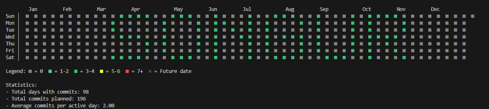
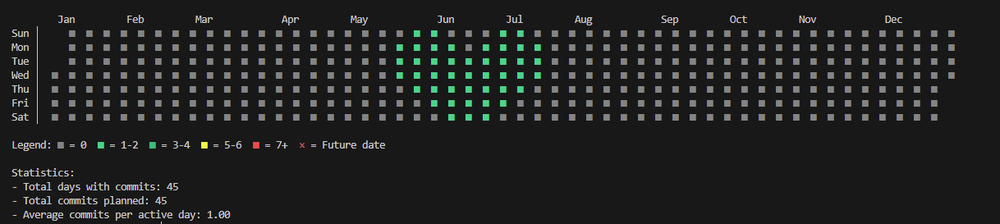
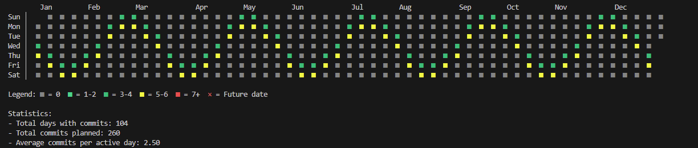

# GitHub Contribution Graph Art CLI 🎨

[](https://github.com/muhammetalisongur/graphic-contribution-greening)
[](LICENSE)
[](https://nodejs.org/)

An interactive CLI tool for creating artistic patterns, text, and shapes on your GitHub contribution graph.

> **[Türkçe README için tıklayın](README.tr.md)**

## 📸 Screenshots

### Text Pattern


### Heart Shape


### Wave Effect


## ✨ Features

### Interactive CLI Mode
- 📝 **Text Rendering** - Write messages on your contribution graph (A-Z, 0-9)
- 🎨 **Pre-built Shapes** - Heart, star, triangle, square, diamond
- 🌊 **Effects** - Wave, checkerboard, spiral, diagonal, random
- 📊 **GitHub Profile Analysis** - Analyze your contribution patterns
- 💾 **Pattern Management** - Save and load custom patterns
- 🔍 **Smart Detection** - Identifies empty spaces and suggests patterns
- 🎯 **Flexible Configuration** - Customizable intensity and effects

### GitHub Profile Analysis
- Fetches current contribution data
- Detects empty spaces in your graph
- Provides pattern placement suggestions
- Shows yearly statistics
- Identifies optimal weeks for patterns

## 📦 Installation

### ⚠️ Important: Fork First!

**You must fork this repository to your own GitHub account** because the tool creates commits in your repository to generate patterns on your contribution graph.

1. **Fork the repository**: Click the "Fork" button at the top-right of this page
2. **Clone your fork**:

```bash
# Clone YOUR forked repository (replace YOUR_USERNAME)
git clone https://github.com/YOUR_USERNAME/graphic-contribution-greening.git
cd graphic-contribution-greening

# Install dependencies
npm install
```

## 🔧 Configuration

### GitHub Token (Optional - Required for Profile Analysis)

Create a Personal Access Token (Classic):

**Quick Link:** [Generate Token (Classic)](https://github.com/settings/tokens/new)

Or manually:

1. Go to GitHub → **Settings** (click your profile picture, top-right)
2. Scroll down → **Developer settings** (left sidebar)
3. Click **Personal access tokens** → **Tokens (classic)**
4. Click **Generate new token** → **Generate new token (classic)**
5. Fill in the form:
   - **Note**: Give your token a name (e.g., "Contribution Graph CLI")
   - **Expiration**: Choose an expiration date (recommended: 90 days)
   - **Select scopes**: Check **`read:user`** (for reading profile data)
6. Click **Generate token** (bottom of page)
7. **⚠️ Important**: Copy your token immediately - you won't see it again!
8. Create a `.env` file in the project root and add your token:

```env
GITHUB_TOKEN=your_github_personal_access_token_here
GITHUB_USERNAME=your_github_username_here
```

## 🎮 Usage

### Interactive CLI Mode (Recommended)

```bash
npm start
```

Or:

```bash
node bin/cli.js
```

### Main Menu Options

1. **🎨 Create New Pattern** - Create text, shapes, or effects
2. **📊 Analyze GitHub Profile** - Analyze your contribution graph
3. **📂 Load Saved Pattern** - Use previously saved patterns
4. **⚙️ Settings** - Configure token and username

### Pattern Types

#### 📝 Text Pattern
```javascript
{
  type: "text",
  content: "HELLO",
  startWeek: 10,
  intensity: 3
}
```
Renders text starting from week 10 with medium intensity (3 commits per cell).

#### 🎨 Pre-built Shapes
- ❤️ Heart
- ⭐ Star
- 📐 Triangle
- ⬜ Square
- 🔷 Diamond

#### 🌊 Effects
- **Wave** - Sine wave pattern across the year
- **Checkerboard** - Alternating pattern
- **Diagonal** - Diagonal line
- **Spiral** - Spiral pattern
- **Random** - Random distribution

#### 📊 Manual Pattern
Specify exact week, day, and commit count for precise control.

## 📊 CLI Flow

```
1. Year Selection (2020-2025)
   ↓
2. Mode Selection (Text/Shape/Effect/Manual)
   ↓
3. Configure Parameters
   ↓
4. Preview Pattern
   ↓
5. Save/Push/Cancel
```

## 🔍 GitHub Profile Analysis

Analysis features:
- **Total contribution count** - Overall yearly activity
- **Active/empty day ratio** - Percentage of days with commits
- **Busiest day detection** - Day with most contributions
- **Streak tracking** - Current, max, and longest empty streaks
- **Day distribution** - Contribution patterns by day of week (Sun-Sat)
- **Monthly trend analysis** - Monthly contribution breakdown with bar charts
- **Empty space detection** - Identifies consecutive weeks with no activity (min 3 weeks)
- **Smart text placement suggestions** - Analyzes empty spaces and suggests optimal weeks for your text based on length
- **Pattern placement recommendations** - Recommends optimal weeks for shapes and effects
- **Fill rate calculation** - Measures graph density as percentage
- **Year comparison** - Compare current year with previous year's statistics
- **Active years detection** - Automatically detects your account creation year and validates year selection
- **Account creation validation** - Prevents creating commits before your GitHub account existed

## 💾 Pattern Management

Save and reuse your patterns:
- **Save**: After creating a pattern, choose "💾 Save" and give it a name
- **Load**: From main menu, select "📂 Load Saved Pattern"
- **Clear**: In settings, clear all saved patterns
- **Metadata**: Each saved pattern includes statistics (total commits, total days, week range, creation date)

## 🛠️ Advanced Features

### Multi-line Text Support
Write text across multiple rows with configurable line spacing.

### Smart Text Placement
- Automatically analyzes empty spaces in your contribution graph
- Suggests optimal weeks to place your text based on text length
- Each character requires ~6 weeks of space
- Prevents text from being cut off or overlapping existing contributions

### Pattern Validation
All patterns are automatically validated before creation:
- Week range: 1-52 (or 1-53 for leap years)
- Day range: 0-6 (Sunday=0, Saturday=6)
- Commit count: 1-20 (warns if excessive)
- Date validation: Prevents commits before account creation or in the future

### Future Commit Detection
- Automatically detects future dates in patterns
- Shows warning before pushing
- Displays future commits with special markers in preview (⏰ or F)
- Skips future commits during push to prevent errors

### Manual Pattern - "All Week" Keyword
When creating manual patterns, you can use "All week" option to apply the pattern to all 7 days at once.

### Effect Parameters
Customize effects with advanced parameters:
- **Wave**: `amplitude` (wave height), `wavelength` (wave frequency)
- **Checkerboard**: `startWeek`, `endWeek` (range control)
- **Spiral**: `startWeek` (starting position)
- **Random**: `count` (number of random commits)

### Automatic Configuration
- Auto-creates `.env` file with template on first run
- Detects GitHub username from git remote URL
- Smart year suggestions based on account creation date

## 📊 Visualization Modes

- **ASCII**: Simple terminal visualization
- **Color**: Colored terminal output
- **Emoji**: Emoji-based visualization

## ⚠️ Important Notes

1. **Year Start Offset**: Years don't always start on Sunday - some cells at the beginning may be empty
2. **Commit Limits**: Very high commit counts may appear suspicious
3. **Private Repositories**: Recommended for testing
4. **Rate Limiting**: Be mindful of GitHub API rate limits
5. **Account Age**: Creating commits before your account creation date will appear suspicious

## 📁 Project Structure

```
graphic-contribution-greening/
├── bin/
│   └── cli.js              # CLI entry point
├── src/
│   ├── constants/          # Application constants (messages, config)
│   │   ├── cli-messages.js
│   │   ├── messages.js
│   │   └── config.js
│   ├── core/               # Core logic (grid, patterns, text)
│   │   ├── grid-calculator.js
│   │   ├── pattern-builder.js
│   │   └── text-to-pattern.js
│   ├── services/           # External services (GitHub API, config)
│   │   ├── github-analyzer.js
│   │   └── config-manager.js
│   ├── ui/                 # User interface (CLI, visualizer)
│   │   ├── cli-interface.js
│   │   └── visualizer.js
│   └── utils/              # Utility functions
│       ├── pattern-utils.js
│       └── date-helpers.js
├── patterns/               # Pattern definitions (letters, shapes)
│   └── letters.js
└── contribution-tracker.json  # Commit tracking data
```

## 🚀 Development Scripts

```bash
# Start the CLI (interactive mode)
npm start

# Run in development mode
npm run dev
```

## 🤝 Contributing

Contributions are welcome! Please feel free to submit a Pull Request.

1. Fork the repository
2. Create your feature branch (`git checkout -b feature/AmazingFeature`)
3. Commit your changes (`git commit -m 'Add some AmazingFeature'`)
4. Push to the branch (`git push origin feature/AmazingFeature`)
5. Open a Pull Request

### Development Guidelines

- Follow the existing code style
- Write meaningful commit messages
- Update documentation as needed
- Test manually before committing

## 📄 License

ISC

## 🙏 Acknowledgments

- [simple-git](https://github.com/steveukx/git-js) - Git operations
- [inquirer](https://github.com/SBoudrias/Inquirer.js) - Interactive CLI
- [chalk](https://github.com/chalk/chalk) - Terminal styling
- [ora](https://github.com/sindresorhus/ora) - Loading spinners
- [moment](https://github.com/moment/moment) - Date manipulation
- [axios](https://github.com/axios/axios) - HTTP client

## 📧 Contact

GitHub: [@muhammetalisongur](https://github.com/muhammetalisongur)

## 🌟 Show Your Support

Give a ⭐️ if this project helped you!

---

**Note**: This tool is for educational and artistic purposes. Use responsibly and be mindful of GitHub's Terms of Service.
