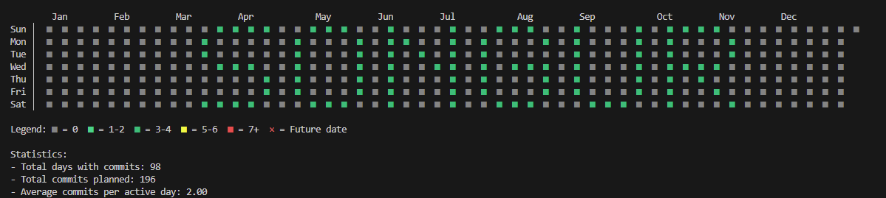
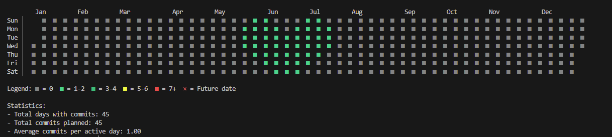
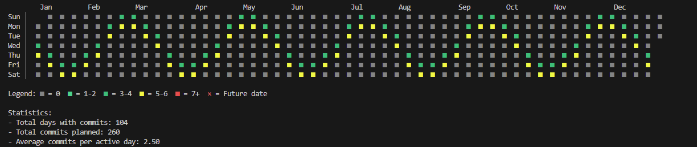

# GitHub Contribution Graph Art CLI 🎨

GitHub contribution graph'ınıza yazı, şekil ve desenler ekleyen interaktif CLI aracı.

## 📸 Ekran Görüntüleri

### Metin Pattern'i


### Kalp Şekli


### Dalga Efekti


## 🚀 Özellikler

### İnteraktif CLI Modu
- ✨ Adım adım pattern oluşturma
- 📊 GitHub profil analizi
- 💾 Pattern kaydetme ve yükleme
- 🎨 Hazır şekiller (kalp, yıldız, üçgen, kare, elmas)
- 🌊 Efektler (dalga, satranç tahtası, spiral)
- 📝 Metin yazdırma (A-Z, 0-9)
- 🔍 Boş alan tespiti ve öneri sistemi

### GitHub Profil Analizi
- Mevcut contribution verilerini çeker
- Boş alanları tespit eder
- Pattern yerleştirme önerileri sunar
- Yıllık istatistikler gösterir

## 📦 Kurulum

### ⚠️ Önemli: Önce Fork Yapın!

**Bu repoyu kendi GitHub hesabınıza fork etmelisiniz** çünkü araç, contribution graph'ınızda pattern oluşturmak için kendi repo'nuza commit atar.

1. **Repoyu fork edin**: Bu sayfanın sağ üstündeki "Fork" butonuna tıklayın
2. **Fork'unuzu klonlayın**:

```bash
# KENDİ fork'ladığınız repoyu klonlayın (YOUR_USERNAME'i değiştirin)
git clone https://github.com/YOUR_USERNAME/graphic-contribution-greening.git
cd graphic-contribution-greening

# Bağımlılıkları yükle
npm install
```

## 🔧 Konfigürasyon

### GitHub Token (Opsiyonel - Profil analizi için)

Personal Access Token (Classic) oluşturun:

**Hızlı Link:** [Token Oluştur (Classic)](https://github.com/settings/tokens/new)

Veya manuel:

1. GitHub → **Settings** (sağ üst köşede profil resminize tıklayın)
2. Aşağı kaydırın → **Developer settings** (sol menü)
3. **Personal access tokens** → **Tokens (classic)** tıklayın
4. **Generate new token** → **Generate new token (classic)** seçin
5. Formu doldurun:
   - **Note**: Token'ınıza isim verin (örn: "Contribution Graph CLI")
   - **Expiration**: Son kullanma tarihi seçin (önerilen: 90 gün)
   - **Select scopes**: **`read:user`** işaretleyin (profil verilerini okuma için)
6. **Generate token** butonuna tıklayın (sayfanın altında)
7. **⚠️ Önemli**: Token'ı hemen kopyalayın - bir daha göremezsiniz!
8. Proje klasöründe `.env` dosyası oluşturun ve token'ı ekleyin:

```env
GITHUB_TOKEN=your_github_personal_access_token_here
GITHUB_USERNAME=your_github_username_here
```

## 🎮 Kullanım

### İnteraktif CLI Modu (Önerilen)

```bash
npm start
```

veya

```bash
node bin/cli.js
```

Açılan menüden:
1. **🎨 Yeni Pattern Oluştur** - Yazı, şekil veya efekt ekle
2. **📊 GitHub Profil Analizi** - Mevcut contribution'ları analiz et
3. **📂 Kayıtlı Pattern Yükle** - Önceden kaydettiğin pattern'leri kullan
4. **⚙️ Ayarlar** - Token ve kullanıcı adı ayarla

## 🎨 Pattern Türleri

### 📝 Yazı Yazdırma
```javascript
// "HELLO" yazısını 10. haftadan itibaren yaz
{
  type: "text",
  content: "HELLO",
  startWeek: 10,
  intensity: 3
}
```

### 🎨 Hazır Şekiller
- ❤️ Kalp
- ⭐ Yıldız
- 📐 Üçgen
- ⬜ Kare
- 🔷 Elmas

### 🌊 Efektler
- Dalga deseni
- Satranç tahtası
- Diyagonal çizgi
- Spiral
- Random

### 📊 Manuel Pattern
Hafta ve gün bazında özel commit sayıları belirleme

## 📋 CLI Akışı

```
1. Yıl Seçimi (2020-2025)
   ↓
2. Mod Seçimi (Yazı/Şekil/Efekt/Manuel)
   ↓
3. Parametreleri Belirleme
   ↓
4. Önizleme
   ↓
5. Kaydet/Gönder/İptal
```

## 🔍 GitHub Profil Analizi

Analiz özellikleri:
- **Toplam contribution sayısı** - Yıllık toplam aktivite
- **Aktif/boş gün oranı** - Commit'li günlerin yüzdesi
- **En yoğun gün tespiti** - En fazla contribution'a sahip gün
- **Streak takibi** - Mevcut, maksimum ve en uzun boş streak'ler
- **Gün dağılımı** - Haftanın günlerine göre contribution dağılımı (Paz-Cmt)
- **Aylık trend analizi** - Bar grafikli aylık contribution dökümü
- **Boş alan tespiti** - Ardışık boş haftaları belirler (min 3 hafta)
- **Akıllı metin yerleştirme önerileri** - Metin uzunluğuna göre optimal haftalar önerir
- **Pattern yerleştirme önerileri** - Şekil ve efektler için optimal haftalar önerir
- **Doluluk oranı hesaplama** - Graph yoğunluğunu yüzde olarak ölçer
- **Yıl karşılaştırma** - Mevcut yılı önceki yıl istatistikleriyle karşılaştırır
- **Aktif yıl tespiti** - Hesap oluşturma yılını otomatik tespit eder ve doğrular
- **Hesap oluşturma doğrulaması** - GitHub hesabınızdan önce commit oluşturmayı engeller

## 💾 Pattern Yönetimi

Pattern'lerinizi kaydedin ve tekrar kullanın:
- **Kaydetme**: Pattern oluşturduktan sonra "💾 Kaydet" seçip isim verin
- **Yükleme**: Ana menüden "📂 Kayıtlı Pattern Yükle"
- **Silme**: Ayarlardan tüm pattern'leri temizleme
- **Metadata**: Her kaydedilen pattern istatistikler içerir (toplam commit, gün sayısı, hafta aralığı, oluşturma tarihi)

## 🛠️ Gelişmiş Özellikler

### Çok Satırlı Metin Desteği
Ayarlanabilir satır aralığı ile birden fazla satırda metin yazabilirsiniz.

### Akıllı Metin Yerleştirme
- Contribution graph'ınızdaki boş alanları otomatik analiz eder
- Metin uzunluğuna göre optimal haftalar önerir
- Her karakter ~6 haftalık alan gerektirir
- Metnin kesilmesini veya mevcut contribution'larla çakışmasını önler

### Pattern Doğrulama
Tüm pattern'ler oluşturulmadan önce otomatik doğrulanır:
- Hafta aralığı: 1-52 (veya artık yıllar için 1-53)
- Gün aralığı: 0-6 (Pazar=0, Cumartesi=6)
- Commit sayısı: 1-20 (fazlaysa uyarı verir)
- Tarih doğrulama: Hesap oluşturmadan önce veya gelecekte commit engellenir

### Gelecek Commit Tespiti
- Pattern'deki gelecek tarihleri otomatik tespit eder
- Push öncesi uyarı gösterir
- Önizlemede gelecek commit'leri özel işaretleyicilerle gösterir (⏰ veya F)
- Push sırasında gelecek commit'leri atlar

### Manuel Pattern - "Tüm Hafta" Seçeneği
Manuel pattern oluştururken "All week" seçeneği ile pattern'i aynı anda 7 güne uygulayabilirsiniz.

### Efekt Parametreleri
Efektleri gelişmiş parametrelerle özelleştirin:
- **Wave**: `amplitude` (dalga yüksekliği), `wavelength` (dalga frekansı)
- **Checkerboard**: `startWeek`, `endWeek` (aralık kontrolü)
- **Spiral**: `startWeek` (başlangıç pozisyonu)
- **Random**: `count` (rastgele commit sayısı)

### Otomatik Yapılandırma
- İlk çalıştırmada şablon `.env` dosyasını otomatik oluşturur
- Git remote URL'den GitHub kullanıcı adını tespit eder
- Hesap oluşturma tarihine göre akıllı yıl önerileri

## 📊 Visualizer Modları

- **ASCII**: Terminal'de basit görünüm
- **Color**: Renkli terminal görünümü
- **Emoji**: Emoji ile görselleştirme

## 📁 Proje Yapısı

```
graphic-contribution-greening/
├── bin/
│   └── cli.js              # CLI giriş noktası
├── src/
│   ├── constants/          # Uygulama sabitleri (mesajlar, config)
│   │   ├── cli-messages.js
│   │   ├── messages.js
│   │   └── config.js
│   ├── core/               # Temel mantık (grid, pattern'ler, yazı)
│   │   ├── grid-calculator.js
│   │   ├── pattern-builder.js
│   │   └── text-to-pattern.js
│   ├── services/           # Dış servisler (GitHub API, config)
│   │   ├── github-analyzer.js
│   │   └── config-manager.js
│   ├── ui/                 # Kullanıcı arayüzü (CLI, görselleştirme)
│   │   ├── cli-interface.js
│   │   └── visualizer.js
│   └── utils/              # Yardımcı fonksiyonlar
│       ├── pattern-utils.js
│       └── date-helpers.js
├── patterns/               # Pattern tanımları (harfler, şekiller)
│   └── letters.js
└── contribution-tracker.json  # Commit takip verisi
```

## 🚀 Geliştirme Komutları

```bash
# CLI'yi başlat (interaktif mod)
npm start

# Geliştirme modunda çalıştır
npm run dev
```

## ⚠️ Önemli Notlar

1. **Yıl Başı Offset**: Yıllar her zaman Pazar'dan başlamaz - bazı yılların başındaki kutular boş olabilir
2. **Commit Limitleri**: Çok yüksek commit sayıları şüpheli görünebilir
3. **Private Repo**: Test için private repo kullanmanız önerilir
4. **Rate Limiting**: GitHub API rate limit'e dikkat edin
5. **Hesap Yaşı**: Hesap oluşturma tarihinden önce commit atmak şüpheli görünür

## 🤝 Katkıda Bulunma

Katkılarınızı bekliyoruz! Pull Request göndermekten çekinmeyin.

1. Repo'yu fork edin
2. Feature branch'i oluşturun (`git checkout -b feature/HarikaBirOzellik`)
3. Değişikliklerinizi commit edin (`git commit -m 'Harika bir özellik ekle'`)
4. Branch'inizi push edin (`git push origin feature/HarikaBirOzellik`)
5. Pull Request açın

### Geliştirme Kuralları

- Mevcut kod stiline uyun
- Anlamlı commit mesajları yazın
- Dokümantasyonu güncelleyin
- Commit'lemeden önce manuel test yapın

## 📄 Lisans

ISC

## 🙏 Teşekkürler

- [simple-git](https://github.com/steveukx/git-js) - Git işlemleri
- [inquirer](https://github.com/SBoudrias/Inquirer.js) - İnteraktif CLI
- [chalk](https://github.com/chalk/chalk) - Terminal renklendirme
- [ora](https://github.com/sindresorhus/ora) - Loading spinner'ları
- [moment](https://github.com/moment/moment) - Tarih manipülasyonu
- [axios](https://github.com/axios/axios) - HTTP client

## 📧 İletişim

GitHub: [@muhammetalisongur](https://github.com/muhammetalisongur)

## 🌟 Destek

Projeyi beğendiyseniz ⭐️ vermeyi unutmayın!

---

**Not**: Bu araç eğitim ve sanatsal amaçlar içindir. Sorumlu kullanın ve GitHub Kullanım Şartları'na dikkat edin.
